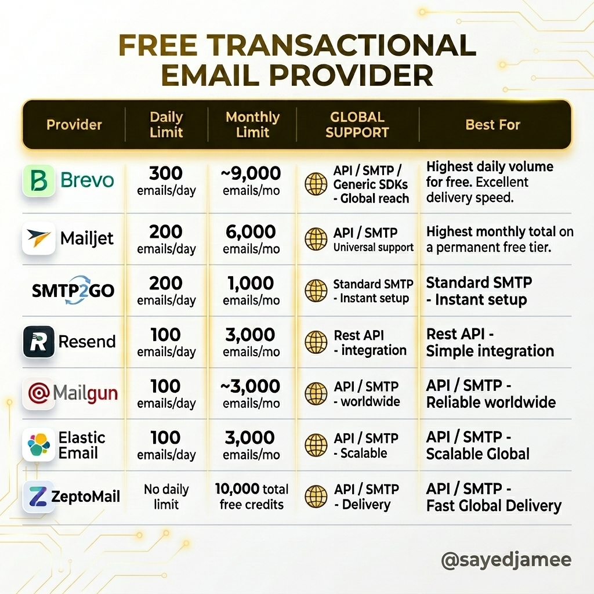
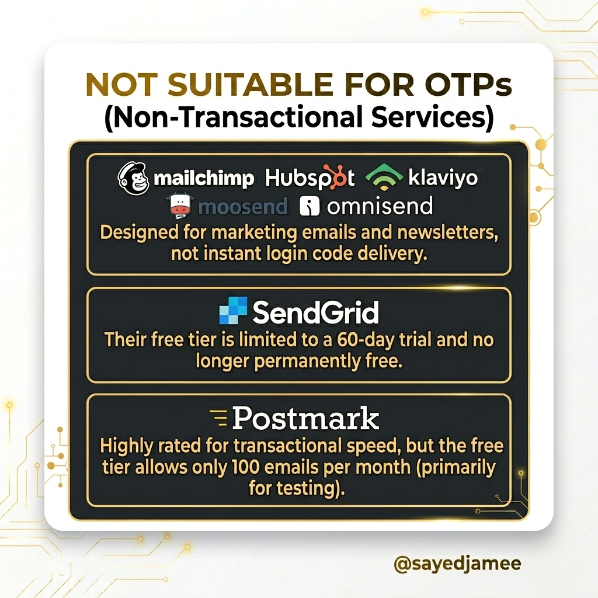
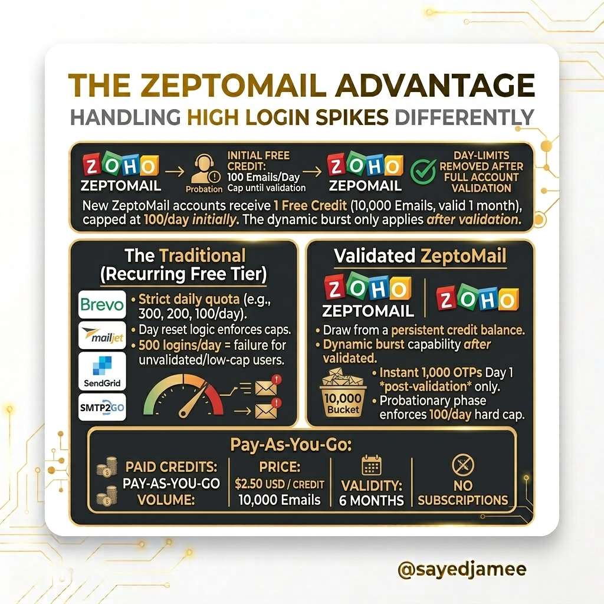

# 📧 Transactional Email Providers & High Volume Handling

A comprehensive guide and breakdown of free transactional email providers, non-transactional services to avoid for OTPs, and an in-depth look at handling high login spikes efficiently.

> **Curated by:** [@sayedjamee](https://github.com/sayedjamee)
> **Data Validated:** As of 2026

---

## 📊 1. Free Transactional Email Providers

When building applications that require email delivery (like OTPs, password resets, and notifications), choosing the right free tier is crucial. Below is a comparison of top providers based on their permanent free offerings.

| Provider | Daily Limit | Monthly Limit | Global Support | Best For |
| :--- | :--- | :--- | :--- | :--- |
| **Brevo** | 300 emails/day | ~9,000 emails/mo | API / SMTP / Generic SDKs - Global reach | Highest daily volume for free. Excellent delivery speed. |
| **Mailjet** | 200 emails/day | 6,000 emails/mo | API / SMTP - Universal support | Highest monthly total on a permanent free tier. |
| **SMTP2GO** | 200 emails/day | 1,000 emails/mo | Standard SMTP - Instant setup | Standard SMTP - Instant setup. Reliable backup. |
| **Resend** | 100 emails/day | 3,000 emails/mo | Rest API - integration | Rest API - Simple integration for developers. |
| **Mailgun** | 100 emails/day | ~3,000 emails/mo | API / SMTP - worldwide | API / SMTP - Reliable worldwide. |
| **Elastic Email**| 100 emails/day | 3,000 emails/mo | API / SMTP - Scalable | API / SMTP - Scalable Global infrastructure. |
| **ZeptoMail** | **No daily limit*** | 10,000 total free credits | API / SMTP - Delivery | API / SMTP - Fast Global Delivery (High spikes). |

*\*Note on ZeptoMail: No daily limit applies **after** full account validation. See Section 3 for details.*

---

## 🚫 2. NOT Suitable for OTPs (Non-Transactional Services)

For instant transactional needs like Login Codes (OTPs) or Password Resets, avoid the following providers. They are either designed for marketing or have prohibitive free-tier limits.

### 📧 Marketing & Newsletter Platforms
*   **Mailchimp**
*   **HubSpot**
*   **Klaviyo**
*   **Moosend**
*   **Omnisend**
*   *Why?* Designed for bulk marketing emails and newsletters. They lack the instant delivery prioritization required for login code delivery.

### 🛑 Deprecated or Restrictive Free Tiers
*   **SendGrid:** Their free tier is limited to a **60-day trial** (100 emails/day). It is **no longer permanently free**.
*   **Postmark:** Highly rated for transactional speed, but the free tier allows only **100 emails per month** (intended primarily for testing, not production).

---

## 🚀 3. The ZeptoMail Advantage: Handling High Login Spikes Differently

Traditional email providers rely on a **Recurring Free Tier** (e.g., 200 emails resetting every 24 hours). ZeptoMail utilizes a **One-Time Credit System**. Here is how they compare, specifically for handling unpredictable login spikes.

### The Initial Setup & Probation
New ZeptoMail accounts receive **1 Free Credit** (equal to 10,000 emails, valid for 1 month).
*   ⚠️ **Crucial Detail:** Initially, accounts are capped at **100 emails/day** while in the probationary phase until Zoho completes full account validation (~2 business days).
*   The dynamic burst applies **only after validation**.

### The Traditional Model (Recurring Free Tier)
Providers like Brevo, Mailjet, and SendGrid enforce strict daily quotas.
*   **The Bottleneck:** Day reset logic strictly enforces caps.
*   **The Problem:** If you have a cap of 200/day, and 500 users log in on Day 1, emails #201 to #500 will fail or be severely delayed. This equals failure for unvalidated/low-cap users.

### The ZeptoMail Model (Validated Account)
Once a ZeptoMail account is fully validated, the daily limits are removed.
*   **The Advantage:** You draw from a **persistent credit balance**.
*   **Dynamic Burst Capability:** If 1,000 users log in on Day 1, all 1,000 OTP codes send **instantly**. You simply draw down 1,000 emails from your 10,000 bucket, leaving 9,000.

### Pay-As-You-Go 
Once your initial 10,000 free emails are exhausted, ZeptoMail shifts to a Pay-As-You-Go model:
*   **Price:** $2.50 USD per Credit (1 Credit = 10,000 Emails).
*   **Validity:** Purchased credits are valid for **6 months**.
*   **Subscriptions:** **No mandatory monthly subscriptions.** You only pay for what you send.

---

*Generated based on verified provider metrics and official documentation. Follow [@sayedjamee](https://twitter.com/sayedjamee) for more architecture and development insights.*
